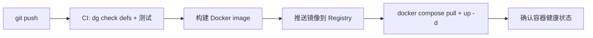

# Dagster 部署参考指南

> **最后更新**: 2026-04-07
> **适用版本**: Dagster 1.12+

## 1. 核心架构组件

任何 Dagster 部署都包含三个长期运行的服务：

| 服务 | 说明 | 副本数 |
|---|---|---|
| **Dagster webserver** | 提供 UI 和 GraphQL API | 可多副本 |
| **Dagster daemon** | 管理 schedules、sensors、run queue | **仅单实例** |
| **Code location server** | 每个 code location 一个 | 每个 location 一个副本 |

---

## 2. 部署方案对比

| 方案 | 适用场景 | 复杂度 | 推荐度 |
|---|---|---|---|
| **Docker Compose** | 中小规模（1-10 个 code locations） | 低 | ⭐⭐⭐⭐⭐ |
| **Docker Swarm** | 2-5 台机器，轻量级集群 | 中 | ⭐⭐⭐⭐ |
| **Celery Launcher** | Python 团队，已有 Redis | 中高 | ⭐⭐⭐⭐ |
| **Kubernetes (Helm)** | 大规模（10+ nodes），生产级 | 高 | ⭐⭐⭐⭐⭐ |
| **SSH Launcher** | 临时/轻量级远程执行 | 低 | ⭐⭐ (Beta) |

---

## 3. 单机部署：Docker Compose

适用于开发测试或小规模生产环境。

```yaml
version: '3.8'

services:
  postgres:
    image: postgres:15
    environment:
      POSTGRES_USER: dagster
      POSTGRES_PASSWORD: dagster
      POSTGRES_DB: dagster
    volumes:
      - postgres_data:/var/lib/postgresql/data

  dagster-webserver:
    image: dagster/dagster:1.12.22
    command: dagster-webserver -h 0.0.0.0 -p 3000
    ports:
      - "3000:3000"
    depends_on:
      - postgres
    volumes:
      - ./dagster.yaml:/opt/dagster/dagster.yaml
      - ./workspace.yaml:/opt/dagster/workspace.yaml
      - ./projects:/opt/dagster/projects

  dagster-daemon:
    image: dagster/dagster:1.12.22
    command: dagster-daemon run
    depends_on:
      - postgres
    volumes:
      - ./dagster.yaml:/opt/dagster/dagster.yaml
      - ./workspace.yaml:/opt/dagster/workspace.yaml
      - ./projects:/opt/dagster/projects

volumes:
  postgres_data:
```

**关键配置**：
- `dagster.yaml`: 实例级配置（数据库连接、run storage 等）
- `workspace.yaml`: 定义如何加载 code locations

---

## 4. 多机部署方案

### 4.1 Docker Swarm（推荐起步）

把多台机器组成一个 Docker 集群，Dagster 连接 Manager 节点即可。

**步骤**：
1.  **初始化集群**：
    ```bash
    # 机器 A (Manager)
    docker swarm init
    # 机器 B/C (Worker)
    docker swarm join --token <token> <A 的 IP>:2377
    ```
2.  **配置 Dagster**：
    设置 `DOCKER_HOST=tcp://<Manager IP>:2375`，Dagster 会自动通过 Swarm 调度任务。

**架构**：
```
Dagster ──▶ Swarm Manager ──▶ Node A / Node B / Node C
```

### 4.2 Celery Run Launcher（灵活分布式）

利用 Celery 作为任务分发层，Worker 分布在多台机器上。

**架构**：
```
Dagster ──▶ Redis Broker ──▶ Worker A / Worker B / Worker C
                                │
                             [Docker]
```

**配置** (`dagster.yaml`)：
```yaml
run_launcher:
  module: dagster_celery.run_launcher
  class: CeleryRunLauncher
  config:
    broker_url: "redis://<Redis IP>:6379/0"
    backend_url: "redis://<Redis IP>:6379/1"
```

**Worker 启动**：
```bash
dagster-celery worker start --app dagster_celery.app
```

### 4.3 Kubernetes（生产标准）

适用于大规模、高可用场景。

**部署命令**：
```bash
helm repo add dagster https://dagster-io.github.io/helm
helm install dagster dagster/dagster -f values.yaml
```

**关键配置** (`values.yaml`)：
```yaml
dagster-user-deployments:
  enabled: true
  deployments:
    - name: "core"
      image:
        repository: "my-registry/core-pipeline"
        tag: "latest"
```

### 4.4 SSH Run Launcher（轻量级）

通过 SSH 在远程机器启动 Docker 容器执行任务。

**配置** (`dagster.yaml`)：
```yaml
run_launcher:
  module: dagster_ssh.run_launcher
  class: SSHRunLauncher
  config:
    host: "remote-host"
    username: "dagster"
    key_filename: "/path/to/ssh/key"
    remote_docker_image: "my-pipeline-image:latest"
```

---

## 5. 安全警告

**⚠️ 严禁直接暴露 Docker 2375 端口！**

*   **风险**：无加密、无认证，任何人连接即拥有 Root 权限。
*   **正确做法**：
    1.  **开启 TLS**：配置 2376 端口，使用证书认证。
    2.  **SSH 隧道**（推荐）：
        ```bash
        ssh -L 2375:localhost:2375 user@remote-host -N
        ```
        然后设置 `DOCKER_HOST=tcp://localhost:2375`。

---

## 6. CI/CD 更新流程

更新个别 asset 或 automation 的标准流程：



**命令示例**：
```bash
# 1. 只重建变更的 code location
docker compose build doris-integration

# 2. 重启服务（不影响其他 location）
docker compose up -d doris-integration

# 3. 验证
docker compose ps
docker compose logs --tail=20 doris-integration
```

---

## 7. 常见问题

**Q: 更新一个 asset 需要重启整个 Dagster 吗？**
A: 不需要。只需重启包含该 asset 的 **code location** 容器。

**Q: 运行中的任务会受影响吗？**
A: 不会。reload 只重新加载定义，已经在跑的 run 会继续完成。

**Q: dagster-daemon 可以有多副本吗？**
A: 不可以。daemon 必须是单实例，否则会导致任务重复执行。
